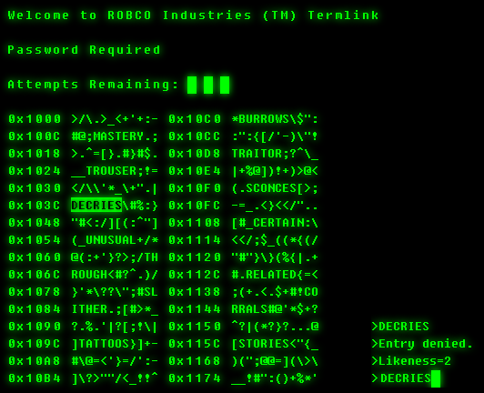

# LAB ASIGNMENT 12 - STRING PARSING and DYNAMID ALLOCATION
Fallout 3             |  Hacking minigame
:-------------------------:|:-------------------------:
|  

You're asigned to write a hacking minigame. Where the user has a number of chances to guess a predetermined password.  
The game is launched by calling  ``minigame.exe settings.ini``
Settings file:

### settings.ini is a text file that contains the password and two numbers all separated by a separator:
```
HIYA 4 15
```
Where first number represents the length of the password, and the second number is the amount of tries the user will get

### The gameplay:
The game should look like this:
```
Welcome to Fallout 3 hacking minigame!
The passphrase contains 4 letters.

you have 15 tries left: HELLO
Wrong number of characters, try again.
you have 15 tries left:
```
after some gameplay :
```
you have 2 tries left: ABCD
incorrect, here's how you did:
ABCD
!...
try again.
you have 1 tries left: YJKA
incorrect, here's how you did:
YJKA
!..+
game over.
```
```
you have 1 tries left: HIYA
correct, here's how you did:
HIYA
++++
you win.
```

After each try the game should print an output exactly in the style shown in the examples.  
After each try the game gives a feedback with these characters for each letter entered:  
***+***: the character is at the right position  
***!***: the character exists in the password but is in the wrong position  
***.***: the character does not exist in password.

### Things that must be implemented:
***You can only use <stdio.h> <stdlib.h> <stdbool.h> in this asignment***  
***Usage of <string.h> bypasses many points that this asignment is designed test***  
1. reading the game settings file (assume the inputs will always be correct)
2. the gameplay shown in the above example
3. ability to type !quit to exit the game

### Things that will be graded
1. arrays that don't have a fixed size should be dynamically allocated (oversized static arrays will not be accepted)
2. any dynamically allocated memory should be freed by the time program finishes.


### Deliverables and Deadline
Submit your soultion wiht a makefile included that names the executable ***minigame***.  
Submit by next week's friday (December 11th) 12:00 am.  
You will also be given a tester program this weekend that'll let you test your program before submission.  


